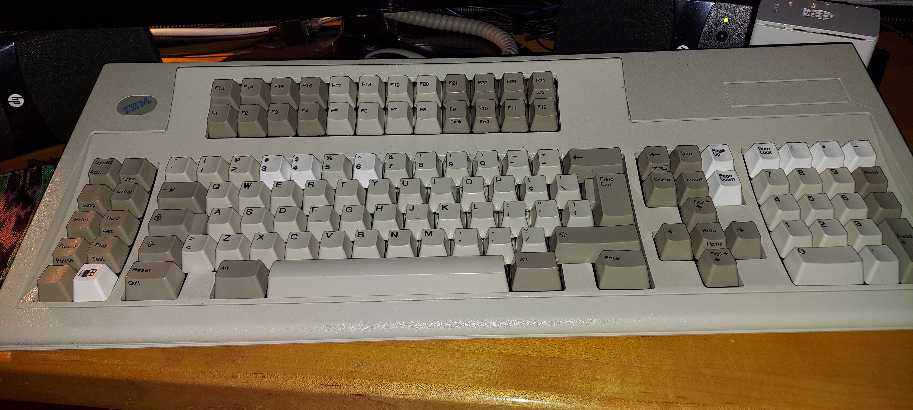

# My "Battlecruiser" Keyboard

My latest acquisition is a genuine IBM Model M 122 built in Scotland in 1997.

The nickname of this model is "Battlecruiser", and you can see why.  It is a large keyboard with the famous "Buckling Spring" keybed.  I have a couple of Unicomp buckling spring keyboard, but this very much original model is different; the springs simply "sing" when used.

Now, this keyboard was purchased off of eBay as both "New and unused" and sold "as-is".  The truth is that is was, for the most part, unused, but it did have some damage.  A few spots on it are, unfortunately, scratched and probably would be very difficult to repair. These spots are on the top of the keyboard case.  Best bet would be to luck into a replace top shell. Also, a couple of the switches didn't work so well, some keycaps had been pillaged, and one keycap broke during shipment.

Because I have the Unicomp keyboards mentioned before, I knew I could use the keycaps from those, although they are not "vintage" nor are the quite the right color, to replace those that I needed for the Battlecruiser.  

I also use a couple of the switches from the Unicomps to replace original switches that were not working as well as they could be.  For the most part, all problems are solved; I don't mind the mis-matched key colors, but I do wish I could do something about the scratches on the case.

 
Now, using this vintage keyboard with Windows 10 (I know, I know; I use Windows 10 as an acceptable platform for my mostly UNIX-experience through WSL 2, VMs, etc.) is a challenge; there is no "logo" key, and this keyboard as intended to be a terminal keyboard.

So, in additional to moving keycaps around, I had to invest in an RJ45-to-USB [Soarer's Converter](https://deskthority.net/viewtopic.php?f=7&t=2510&start=) to get it to work.  This genius device doesn't just make a terminal keyboard work with modern USB, it also has an EEPROM that can store and translate a simple config file using a Teensy-based set of electronics.  All housed in the converter!

So, if you are having to map your IBM Modem M 122 "Battlecruiser" keyboard, the following is my *.sc file, note follow that:

<pre>
layerblock
	FN1 1
endblock

remapblock
layer 0
	F13			MEDIA_MUTE
	F14			MEDIA_VOLUME_UP
	F15			MEDIA_VOLUME_DOWN
	F16			UNASSIGNED
	F17			MEDIA_PLAY_PAUSE
	F18			MEDIA_PREV_TRACK
	F19			MEDIA_NEXT_TRACK
	F20			PRINTSCREEN
	F21			UNASSIGNED
    F22			UNASSIGNED
	F23			PAUSE
	F24			SCROLL_LOCK
	
	EXTRA_F4	UNASSIGNED
	EXTRA_F6	UNASSIGNED
	EXTRA_F7	UNASSIGNED
	EXTRA_F8	UNASSIGNED
`    EXTRA_F9    LCTRL
	EXTRA_F10	LGUI
	
	ESC         NUM_LOCK
	NUM_LOCK	PAD_SLASH
	SCROLL_LOCK	PAD_ASTERIX
	EXTRA_SYSRQ	PAD_MINUS
	PAD_ASTERIX	PAD_PLUS
	PAD_MINUS	UNASSIGNED
	PAD_PLUS	PAD_ENTER
	LANG_4		UNASSIGNED
	EUROPE_1    BACKSLASH
	EUROPE_2	UNASSIGNED
endblock

macroblock

  macro EXTRA_F1
    PUSH_META CLEAR_META all
    MAKE LCTRL
    PRESS C
    BREAK LCTRL
    POP_ALL_META
  endmacro

  macro EXTRA_F2
    PUSH_META CLEAR_META all
    MAKE LCTRL
    PRESS LEFT_BRACE
    BREAK LCTRL
    POP_ALL_META
  endmacro

  macro EXTRA_F3
    PUSH_META CLEAR_META all
    MAKE LCTRL
    PRESS X
    BREAK LCTRL
    POP_ALL_META
  endmacro

  macro EXTRA_F5
    PUSH_META CLEAR_META all
    MAKE LCTRL
    PRESS V
    BREAK LCTRL
    POP_ALL_META
  endmacro

endblock
</pre>

...on this layout, you can see (referencing the Soarer's documentation) the custom key mapping I am using.  One curious thing that I haven't figured out yet:  since I am a VI user, the ESC key is important to me.  I have to institute an alternative, as a "normal" ESC isn't doing the trick.  As you can see from EXTRA_F2, I had to essentially use a macro to do a CTRL-[ instead of ESC.  It seems to work fine in VI and in VI-mode for WSL, Code, etc.  I also had to use macros for copy, cut and paste, but this is alluded to in the Soarer's documentation.

[***...Get back***](../it-the-hard-way.html)
